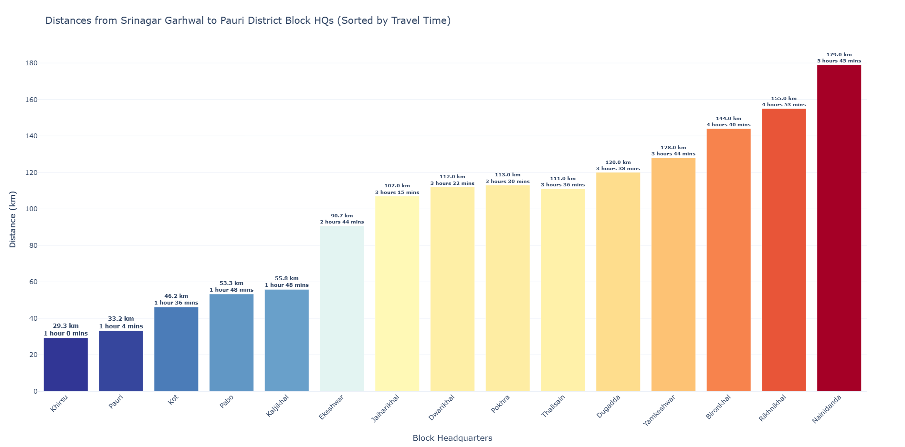

# Distance_measurement
This project calculates and visualizes road distances and travel times from Srinagar Garhwal to all 15 block headquarters in Pauri Garhwal district using the Google Distance Matrix API and Plotly.
# Srinagar to Pauri Block Headquarters Distance Plot

This project calculates road distances and travel times from **Srinagar Garhwal** to the **15 block headquarters** in **Pauri Garhwal District, Uttarakhand**, using the **Google Distance Matrix API**, and visualizes the results using **Plotly** in an interactive bar chart.



---

## 📊 Features

- Fetches live road distances and travel durations via Google Distance Matrix API.
- Creates an interactive Plotly bar chart.
- Sorts blocks by **travel time**.
- Annotates each bar with distance and duration.
- Saves results as interactive `.html`.

---

### 🔑 API Key Setup


1. Visit [Google Cloud Console](https://console.cloud.google.com/)
2. Create/select a project
3. Enable:
   - APIs & Services → Library → Distance Matrix API → Enable
4. Go to:
   - APIs & Services → Credentials → Create Credentials → API key
5. Replace the placeholder in the script with your key:

```python
API_KEY = "YOUR_API_KEY_HERE"

### Install Required Packages
```bash
pip install requests plotly 

